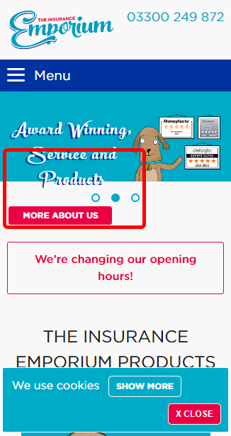
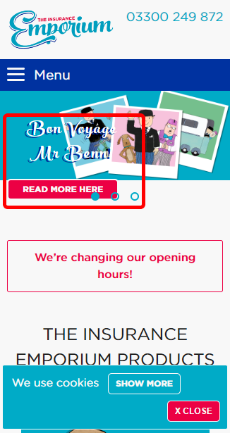
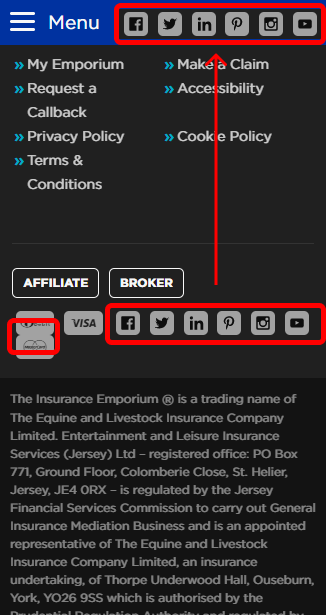

# The Insurance Emporium's Frontend Developer Test  

### 1. What is wrong with the component you chose?  
I have decided to choose and try to improve the carousel component in the Home's hero section mainly for the following reasons:

- Lack of full responsiveness on mobile devices.
- Poor text readability on mobile devices.   
    
    

  
    
    
### 2. How will you improve it?  
I will try to improve both the responsiveness and readability by recreating the carousel component and by adjusting its styling and layout.  

### 3. Given more time what would you further improve?  
If I had more time I would fix a small layout detail in the footer's icons, and move/copy the 'socials' icons into the header in order to improve the UX, as that would allow users to find them more easily at the very beginning of their website navigation.
    
    
  

